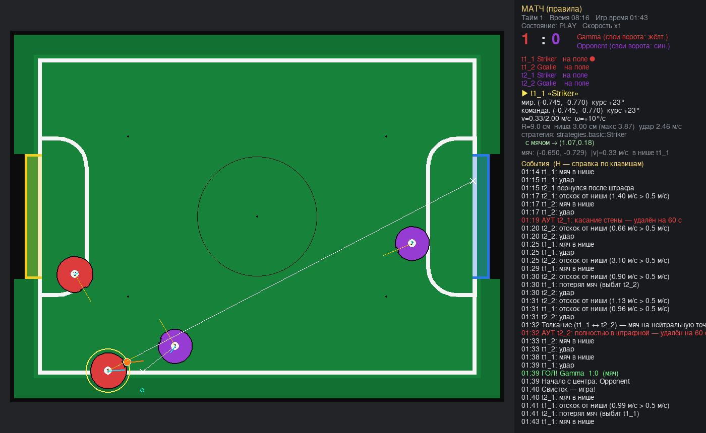

# RCJ Soccer Vision Simulator

Симулятор на pygame для отработки **тактик** роботов RoboCupJunior Soccer Vision (правила 2026).
Две команды по два робота, поле по «Technical Specification For Soccer Fields», судья по правилам
(аут, штрафы, двойная защита, толкание, отсутствие прогресса, тайм, начало с центра).



## Установка и запуск

```bash
pip install -r requirements.txt          # Python 3.10+ (3.11+ рекомендуется)

python main.py                           # 1. матч по правилам (2×10 мин)
python main.py --mode free               # 2. нестрогая игра: без времени, счёт бесконечный
python main.py --mode debug --robot t1_1 # 3. отладка одного робота
python main.py --headless                # матч без окна — быстрая проверка тактик (~50× реального времени)
python -m pytest -q                      # тесты физики и правил
```

Роботы: `t1_1`, `t1_2` (команда 1), `t2_1`, `t2_2` (команда 2). Цифра — номер на верхнем маркере.

## Режимы

| Режим | Время | Правила | Особенности |
|---|---|---|---|
| `match` | 2 тайма × 10 мин, смена сторон, жеребьёвка | все, аут = удаление на 60 с | итоговая разница урезается до 10 |
| `free` | бесконечно | все, аут = сразу на нейтральную точку (настраивается) | |
| `debug` | бесконечно | аут только отмечается | один робот; остальные `hidden` / `frozen` / `active`; панель с `robot.debug()`; `[` `]` — сменить робота |

Правила каждого режима переопределяются в `config.toml` → `[modes.<режим>.rules]`.

## Управление в окне

Все клавиши настраиваются в `config.toml` → `[hotkeys]` (можно с модификаторами: `"ctrl+b"`).

| Клавиша | Действие |
|---|---|
| `B` | мяч в точку под курсором |
| `1` `2` `3` `4` | робот t1_1 / t1_2 / t2_1 / t2_2 в точку под курсором (возвращает и удалённого) |
| `T` | выбранный робот под курсор |
| `Q` / `E` | повернуть выбранного ±15° (с Shift — ±5°), колесо мыши — ±5° |
| `Tab` | выбрать следующего робота |
| `X` | остановить мяч |
| `Space` / `N` | пауза / шаг на один такт управления |
| `=` / `-` | быстрее / медленнее (×0.1…×16) |
| `K` | нейтральное начало с центра |
| `O` | оверлей: цели, курсы, векторы скоростей, метки стратегий |
| `F5` | перезагрузить код стратегий без перезапуска |
| `H` | справка |
| ЛКМ | выбрать / перетащить робота или мяч |
| ПКМ-протяжка от мяча | бросить мяч (скорость ∝ длине протяжки) — удобно проверять захват |

## Программирование тактик

Тактика — класс-наследник `Strategy` в папке `strategies/`. Подключается в `config.toml`:

```toml
[team1]
robots = [
  { name = "Striker", strategy = "strategies.my_team:Attacker" },
  { name = "Goalie",  strategy = "strategies.my_team:Keeper" },
]
```

```python
from rcjsim.api import Strategy, Vec2, angle_diff

class Attacker(Strategy):
    def step(self, world, robot):          # вызывается control_hz раз в секунду (60 Гц)
        me, ball = world.me, world.ball
        goal = world.field.opp_goal
        if me.has_ball:                     # мяч в нише
            h = me.pos.angle_to(goal)
            robot.move_to(goal.x, goal.y, speed=1.0, heading=h)
            if me.pos.dist(goal) < 0.7 and abs(angle_diff(me.heading, h)) < 8:
                robot.kick()                # удар
        else:
            robot.move_to(ball.pos.x, ball.pos.y, speed=0.4,
                          heading=me.pos.angle_to(ball.pos))
```

### Система координат стратегии

При `team_frame = true` (по умолчанию) каждая команда видит поле одинаково: **свои ворота слева (x<0),
чужие справа (x>0)**, курс 0° — на ворота соперника, углы против часовой. После перерыва ничего
менять не нужно. Метры, м/с, градусы. Центр поля — (0, 0), поле ±1.095 × ±0.79 м, стены ±1.215 × ±0.91 м.

### Команды роботу (`robot`)

| Метод | Что делает |
|---|---|
| `move_to(x, y, speed=None, heading=None)` | ехать в точку со скоростью `speed` (м/с, None — макс.), держа курс `heading` (°, None — текущий). Робот голономный, сам разгоняется/тормозит с `max_accel`. Точку, скорость и курс можно менять каждый такт |
| `move(vx, vy, heading=None, omega=None)` | задать вектор скорости; курс — либо целевой `heading`, либо угловая скорость `omega` (°/с) |
| `move_dir(direction, speed, heading=None)` | ехать в направлении (°) |
| `rotate_to(heading)` | стоять и развернуться |
| `stop()` | остановиться |
| `kick(power=1.0) -> bool` | удар (0..1 от макс. силы). Работает, если мяч в нише или вплотную в ней; перезарядка `kick_cooldown_s` |
| `can_kick`, `has_ball`, `kick_speed` | свойства |
| `debug(text)`, `mark(x, y, color, label)`, `line(x1, y1, x2, y2, color)` | отладочный вывод на панель и поле |

### Данные мира (`world`)

- `world.me`, `world.teammates`, `world.opponents` — `RobotInfo`: `pos`, `heading`, `vel`, `speed`, `omega`,
  `radius`, `niche_width`, `seat_dist`, `niche_pos`, `has_ball`, `on_field`, `penalty_left`, `max_speed`.
- `world.ball` — `pos`, `vel`, `speed`, `in_niche`, `owner` (id), `owner_team`.
- `world.field` — `own_goal`, `opp_goal`, `half_length`, `half_width`, `wall_x`, `wall_y`, `neutral_spots`,
  `penalty_distance(p, own)`, `in_penalty_area(p, radius, own, fully)`, `wall_clearance(p, radius)`, `in_field(p)`.
- `world.time`, `time_left`, `half`, `state` (`PLAY`/`KICKOFF`/…), `score_us`, `score_them`, `kickoff_us`, `mode`, `rules`.
- `world.shared` — общий словарь команды (связь между роботами разрешена правилами 1.3.A).

Необязательные методы `Strategy`: `setup(world)`, `on_kickoff(world, kicking)`,
`kickoff_position(world, kicking) -> (x, y, курс)` — своя расстановка (проверяется по п. 2.3,
недопустимая заменяется позицией по умолчанию).

Ошибка в коде стратегии не роняет симулятор: робот останавливается, ошибка — в журнале и на панели.
Правите файл → `F5`.

Пример полноценных тактик (нападающий + вратарь): `strategies/basic.py`.

## Что смоделировано

**Поле** (field_specification 2026): 219×158 см по внешнему краю линии, линии 20 мм, внешняя зона 12 см,
стены 243×182 см, ворота 60 см × 74 мм (жёлтые слева, синие справа, штанги над линией), штрафные
25×80 см со скруглением R15 (линия — часть зоны), центральный круг Ø60 см, 5 нейтральных точек
(центр и 45 см от коротких сторон на продолжении штрафных), клин 10 см/2 см у стен (кроме ворот) —
мяч скатывается обратно в поле.

**Робот**: круг R = 7…9 см (п. 6.2.A — Ø ≤ 18 см), спереди ниша шириной от 1 см до максимума.
Правила ограничивают не ширину, а глубину захода мяча в выпуклую оболочку — **1.5 см** (п. 6.2.A.2);
симулятор пересчитывает это в максимальную ширину ниши (≈3.83 см при R = 7 см, ≈3.87 см при R = 9 см).
Значения вне диапазона обрезаются с предупреждением в журнале.

**Мяч и ниша**: Ø 42 мм, качение с замедлением, отскоки от стен/ворот/корпусов. Мяч, попавший в нишу с
относительной скоростью **≤ 0.5 м/с**, остаётся в ней (дриблер) и едет с роботом; быстрее — отскакивает.
Мяч теряется при резком боковом ускорении/торможении/вращении (`dribbler_max_*`) или когда его касается
другой робот (п. 2.5.3 — мяч должен быть доступен другим).

**Удар**: по умолчанию сила — максимальная, проходящая проверку кикера из Appendix A (удар от задней
стенки своих ворот не должен после отскока вернуться к ней). Для R = 9 см ≈ 2.46 м/с.

**Судья**:
- аут (п. 2.8): касание стены или робот полностью в штрафной → удаление на 60 с, возврат на свободную
  нейтральную точку, самую дальнюю от мяча, лицом к своим воротам; при начале с центра удалённые
  возвращаются досрочно. Опции: `out_action = penalty | reposition | none`, `out_of_bounds = false`;
- двойная защита (п. 2.6.2), толкание в штрафной (п. 2.6.3), нет прогресса (п. 2.7);
- гол — касание задней стенки ворот; начало с центра за пропустившей командой; расстановка по п. 2.3
  (своя половина, соперник вне круга 30 см); 2 тайма, смена сторон, второй тайм начинает другая команда.

**Не моделируется** (решения на усмотрение судьи): «pushed out» без штрафа, повреждённые роботы (2.9),
оценка удержания мяча (2.5.1). В правилах 2026 **нет ограничения максимальной скорости** — задайте
реальную скорость вашего робота в `max_speed`.

## Структура

```
main.py              запуск, CLI
config.toml          все настройки: команды, роботы, физика, правила, режимы, клавиши
rcjsim/field.py      геометрия поля по спецификации
rcjsim/entities.py   робот (ниша, регулятор движения), мяч, расчёт ниши и силы удара
rcjsim/physics.py    столкновения, захват/удар мяча
rcjsim/referee.py    правила и судейство
rcjsim/game.py       симуляция, режимы, стратегии, телепорты
rcjsim/api.py        API для тактик
rcjsim/render.py     отрисовка
rcjsim/app.py        окно, мышь, горячие клавиши
strategies/          ваши тактики
tests/               pytest
```
